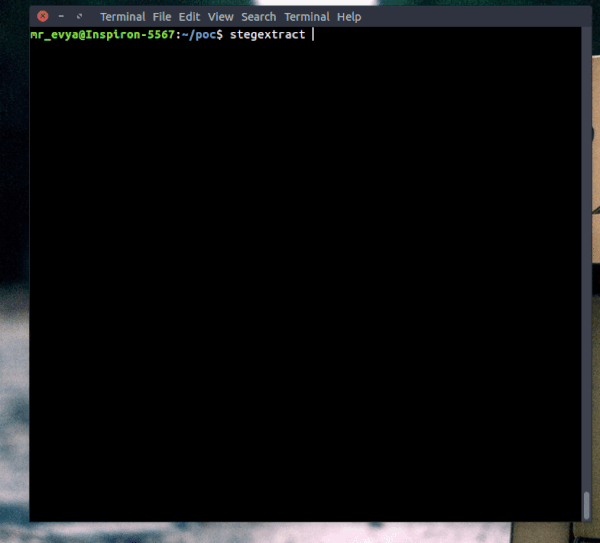

# Stegextract
Bash script to extract hidden files and strings from images.

## Description
Stegextract will detect the input image type and will look for any trailing data after the closing bytes.<br>
If ran with `-a, --analyze` It will also try to detect embedded files by magic numbers.
Short byte combinations such as JPEG's `FFD8 FFE0` might sometimes create false positives.<br>
Manually reviewing the hexdump is sometimes inevitable in cases of highly complex embedded files.<br>
Stegextract is not the solution for any color/pixel/filter/LSB related Steganography, nor does it try to be. It
relies on magic numbers, hexdumps and binary data alone.<br>
Currently supports PNG, JPG, and GIF.

## Installation
```
sudo curl https://raw.githubusercontent.com/evyatarmeged/stegextract/master/stegextract > /bin/stegextract
sudo chmod +x /bin/stegextract
```

## Usage
```
Usage: stegextract <file> [options]

-h, --help                Print this and exit
-o, --outfile             Specify an outfile
-a, --analyze             Perform a deep analysis of embedded files
-s, --strings             Extract strings from file
-q, --quiet               Do not output to stdout
--force-format            Force this image format instead of detecting
```

## POC:


Image examples from the above GIF can be found in the [examples](https://github.com/evyatarmeged/stegextract/tree/master/examples) folder.
